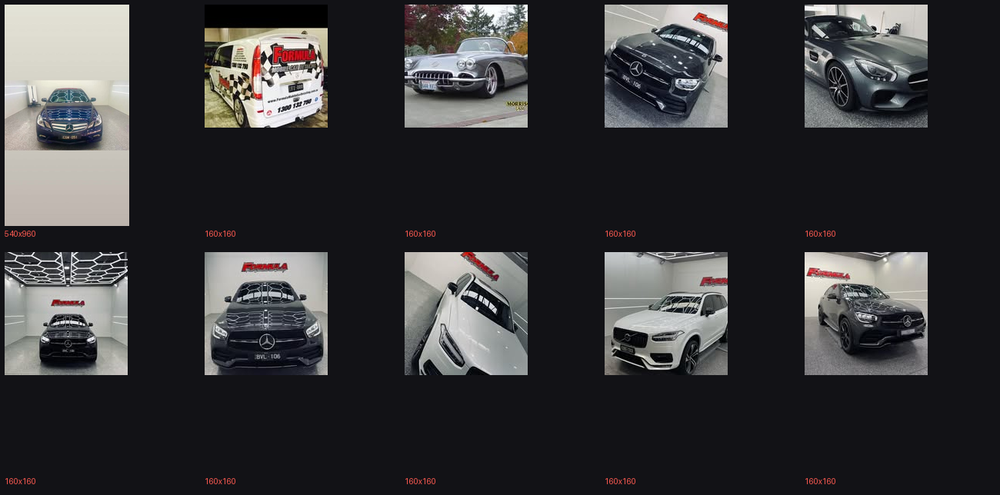

# Sourcing photos from the Facebook page

**Attempted:** 5 Aug 2026 · **Page:** [facebook.com/Formulamobilecardetailing](https://www.facebook.com/Formulamobilecardetailing/) (398 followers)

**Outcome: not integrated.** The photos on the page are exactly what the site needs, but nothing usable can be pulled without being logged in as the page owner. Details below, plus the two routes that do work.



## What's on the page

Ten distinct photos are discoverable without logging in, and the content is genuinely good — real work, not stock:

- A branded **Formula van** (full wrap, `1300 132 750`) — the best trust asset the business has and it appears nowhere on the current site
- A **classic Corvette**
- **Mercedes AMG GT**, several **C-Class / GLC**, a **Volvo XC90**
- Multiple studio-bay shots with the Formula logo watermarked in

This directly answers audit finding 5.10 (no before/after, thin gallery) — the raw material exists, it just isn't reachable this way.

## Why the public route fails

| What was tried | Result |
|---|---|
| `curl` the page | HTTP 400 |
| Headless Chrome, page + `/photos` tab | HTTP 200, but a login wall; only thumbnails render |
| `mbasic.facebook.com` | 302 → `/login/` |
| `/photo/?fbid=<id>` permalink | Login wall |
| Rewrite `stp=` to request a larger transform | **HTTP 403** |
| Strip `stp=` to fetch the original | **HTTP 403** |

fbcdn signs each URL (`oh` / `oe`) **against the exact transform requested**. Change the size in `stp` and the signature no longer matches, so the CDN refuses. The public page only ever asks for thumbnails.

Result: 10 images at **160×160** and one at **540×960**. Everything else on the site is 1600×824 or larger — dropping 160px thumbnails into the gallery would visibly degrade it, so nothing was integrated.

## How to actually get them

**Easiest — Meta Business Suite.** As a Page admin: Business Suite → Content → Photos → select → Download. Returns the originals as uploaded. No code, no tokens.

**Programmatic — Graph API with a Page access token.** Meta has required a token for all Graph endpoints since v2.0; there is no unauthenticated path.

```
GET https://graph.facebook.com/v21.0/{page-id}/photos?type=uploaded
      &fields=images,created_time,name&limit=100
      &access_token={page-token}
```

`images` returns every stored size, largest first — take `images[0].source`. Needs `pages_read_engagement` on a token for a page you administer.

**Worth asking first:** the originals are probably still on whoever's phone shot them, at full resolution and without the watermark. That beats anything the API returns.

## Once the originals exist

Drop them in `www/assets/images/gallery/`, then in `tools/build_site.py`:

- add them to `GALLERY` (the gallery page and the homepage strip both read from it)
- consider the van shot for a `SPLASH` slide or the About/contact area
- if any are true **before/after pairs**, they'd let the home hero become a real in-place morph rather than a dissolve — the pairs are naturally registered, which is the one thing the Tesla effect needs and Formula's current hero shots lack

Then `python tools/build_site.py`.
